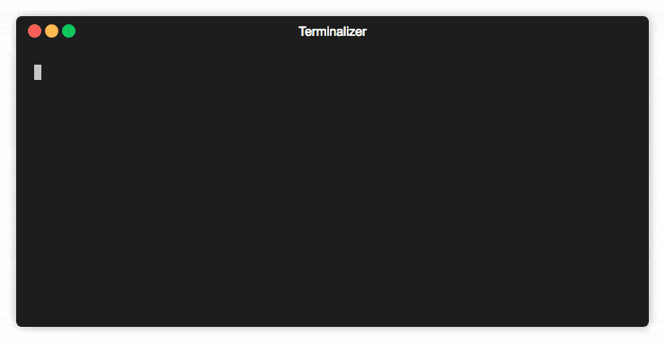

# chronam
Python module for downloading OCR text from http://chroniclingamerica.loc.gov/

This module assumes that you have spent some time on the [Chronicling America](http://chroniclingamerica.loc.gov/) site and wish to download a newspaper's OCR text programmatically from the [API](http://chroniclingamerica.loc.gov/about/api/).

This module will not search, download pdfs, images, etc. It is a simple tool which will save you some clicks and quickly download newspaper issue plain text from the site.



## Installation
To install chronam, clone the GitHub repository to your local environment. chronam uses [Pipenv](https://pipenv.readthedocs.io/en/latest/) to manage dependencies, so ensure that it is installed. (Pipenv is an npm-like package manager for Python.)

>chronam was written and tested in CPython 3.7.0. It is recommended that the user install this version of Python to avoid issues between Python versions. It is possible to create an entirely local installation of Python and chronam's dependecy packages (like, inside the `chronam` directory) with Pipenv. To do a totally local install, set
>```
>export PIPENV_VENV_IN_PROJECT=1
>``` 
>before you run
>```
>pipenv install
>```
>For more details, see https://pipenv.readthedocs.io/en/latest/install/#virtualenv-mapping-caveat.

To install dependencies, run:
```
$ cd path/to/chronam
$ pipenv install
```

This will create a virtualenv and download the specific python packages into it. To run chronam, use the `pipenv` command or spawn a Pipenv shell with `pipenv shell`.

```
$ pipenv run python chronam.py
```

## Executable Usage
`chronam.py` is an executable Python module, and will run the CLI upon execution of `chronam.py`. The module runs the basic workflow with an interactive terminal session and saves the data to the working directory.

### Example of Basic Usage
```
Welcome to Chronicling America Downloader
enter a Library of Congress No. (LCCN): sn84026994
The Charleston daily news. | Library of Congress No.: sn84026994 | Charleston, S.C.
Published from 1865 to 1873 by Cathcart, McMillan & Morton
------------------------
Number of Issues Downloadable: 2641
First issue: 1865-08-21
Last Issue: 1873-04-05

What is the start date to download?(YYYY-MM-DD)
> 1865-08-21
What is the end date to download?(YYYY-MM-DD)
> 1865-08-25
start date: 1865-08-21
end date: 1865-08-25
Getting issues:
1865-08-21
1865-08-22
1865-08-23
3 file(s) written to disk
Data saved to: `/Users/asp/GitHub/chronam/sn84026994`
```

The data will be saved to a folder in the working directory. Subsequent downloads of the same newspaper (as denoted by the LCCN) will be saved in new directories, even if the date ranges downloaded do not overlap. Merging a new date range into an already-present directory is not supported at this time. However, feel free to manipulate the data written by chronam after the program exits. The data is not needed for the program to run again.


## Calling chronam Module in Your Own Python Code
To download OCR text data into an interactive python session, use the `download_newspaper()` function. It requires a Session object from the requests module to attach the HTTP requests to.

See the source code function docstrings for all the details. An [API reference](/docs/api.md) is coming soon.

### Example
Download OCR text of newspaper "The Charleston daily news" published between 21 Aug 1865 and 25 Aug 1865
```python
>>> import requests
>>> import datetime
>>> from chronam import download_newspaper

# Requires a requests module Session object to attach the HTTP request to
>>> ocr = download_newspaper(
        'http://chroniclingamerica.loc.gov/lccn/sn84026994.json',
        datetime.date(1865,8,21),
        datetime.date(1865,8,25),
        requests.Session())
```
Variable `ocr` is a `dict` containing the OCR text for each issue. Keys are dates (`'YYYY-MM-DD'`) and values are a concatenated string of all text for each page of the issue.
```python
>>> ocr.keys()
dict_keys(['1865-08-21', '1865-08-22', '1865-08-23'])

>>> type(ocr['1865-08-21'])
<class 'str'>

>>> len(ocr['1865-08-21'])
131718

>>> ocr['1865-08-21'][:300]
'C-^ta-^t^eV\n/)\nmi..,......\n;^\nCHARLESTON, S. C, MONDAY, AUGUST ?1, 1865.\nPRICE FIVE CENTS.\nRMSTflN DAILY NEWS,\nfCHCART, HoMILLAN & MORTON,\nPBOPWETOBS.\n18 HAYNE-STREET.\n. : TBBM8-CA8H,\n-DAl?-Or?EYEAK.$10.00\nDA?S-SIX "MONTHS.&.0O\nDA???TH?IEE MONTHS.?.30\n?- Staple Copies FIVE CENT8.\nJa-Nows Dealers sup'

>>> ocr['1865-08-21'][-300:]
'ar, et/:, with name and business addreAs, furnished gratia to reuponsiblo\nhous** acting aaagent?. . -. 09 \\1M? ,y:,j? tizo t?\n. " ?OHE DUST, GUANO, etc., furnished by cargo or by the ton. Orders for the Snperphosphate of Lime will bo\n1 rccci vsd by ,_\n-T P. H. KEGLEB, No. 173 East Bay.\nAuguat X? j y'
```
